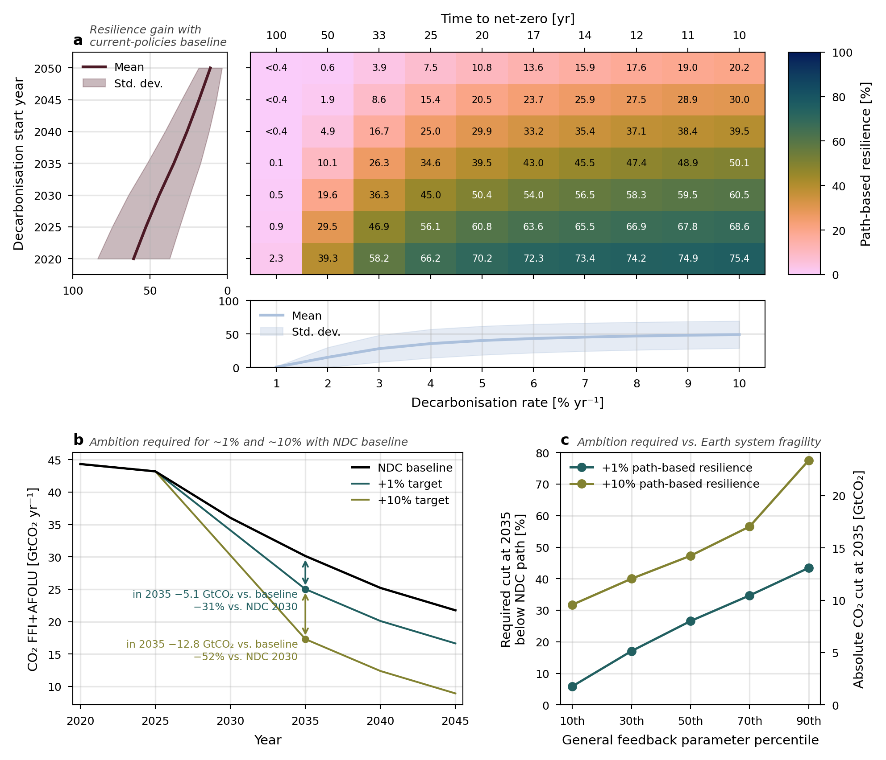

# Path-based Earth-System Resilience

Code base for the forthcoming publication "Ambitious emission reductions maintain Earth resilience, conditional on climate and carbon feedbacks and tipping points".

[](LICENSE)
[](https://doi.org/PENDING)
[](https://www.python.org/)

<!-- FILL IN: preprint/journal link, Zenodo software + dataset DOIs, author list -->

---

## Table of Contents
1. [Background](#background)
2. [Features](#features)
3. [Repository layout](#repository-layout)
4. [Installation](#installation)
5. [Usage](#usage)
6. [Data](#data)
7. [Used software](#used-software)
8. [License](#license)
9. [Citation](#citation)
10. [Contact](#contact)

---

## Background
This project quantifies the **path-based resilience** given a climate mitigation scenario. It is estimated as the share of modelled trajectories that stay within a safe operating state. For each scenario we run a large Monte-Carlo ensemble of the [fair](https://docs.fairmodel.net/) simple climate model (climate-parameter configurations × internal-variability realisations) and a tipping-cascade sampler [pycascades](https://github.com/pik-copan/pycascades), and evaluate three joint conditions:

- **Temperature** — the 20-yr running-mean GMST never exceeds a threshold (default 1.5 °C) from the return year (2100) onward;
- **Rate** — the warming rate never exceeds a threshold (default 0.4 °C per decade);
- **Tipping** — weighted by the committed probability of triggering a tipping cascade (GIS / THC / WAIS / AMAZ).

The pipeline also provides a Sobol/Monte-Carlo sensitivity analysis of the criterion parameters, a generalised feedback parameter (GFP) view, and an "ambition calculator" translating a target resilience gain into required emission cuts (example figure below).



## Features
- Path-based resilience indicator combining temperature, warming-rate, and tipping conditions
- Large fair (2.2.3) Monte-Carlo ensemble over calibrated-constrained climate configurations
- Pycascades tipping-cascade probabilities (cusp elements) via Latin-hypercube sampling
- Sobol + Latin-hypercube sensitivity analysis of the resilience criterion
- Diagnostics of resilience depending on Earth system feedbacks and tipping susceptibility
- Emission "ambition calculator" (required NDC reduction for a target resilience gain)
- Publication-quality figure and table scripts
- Designed to run on a workstation or an HPC/SLURM cluster

---

## Repository layout
The numbered scripts are the pipeline, run in order. Main-paper scripts live at the repo
root; supplementary scripts and the SLURM batch scripts live in subfolders.

| Stage | Scripts | What it does |
|---|---|---|
| Data prep | `00a`, `00b` | `00a` reproduce the NGFS emissions CSV from the licensed IAM workbook; `00b` build the fair v1.4.0 calibration inputs (see [Data](#data)) |
| Inputs & runs | `01`–`06` | clean/extend NGFS emissions, build branch-offs, run the fair ensemble (SSPs, NGFS, branch-offs), concatenate |
| Tipping | `07` | submit the pycascade tipping-cascade sampler (per scenario) |
| Preprocess | `08` | 20-yr running-mean temperatures |
| Resilience | `09`, `09b` | path-based resilience + bootstrap CIs; UpSet-bar CIs |
| Sensitivity | `10` | Sobol + Monte-Carlo over the criterion parameters |
| Feedback/tipping | `11` | GFP, ECS, random-forest tipping susceptibility |
| Calculator | `12`–`14` | resilience "ambition calculator" |
| Main figures | `15`–`17` | trajectories + UpSet; GFP×tipping heatmap; calculator figure |
| Main table | `18` | path-based resilience per scenario (bootstrap + Clopper–Pearson CIs) |
| Supplement | `si/` | SI figures and tables |
| Batch scripts | `batch/` | example SLURM submission scripts (`run_*.sh`) |

> **The `batch/run_*.sh` SLURM scripts are cluster-specific examples.** Adapt the `--account`, `--chdir` and `module`/`conda` lines for your HPC.

---

## Installation

### Requirements
- Python `3.14` (other versions may work; exact reproducibility is only guaranteed with this one)
- The dependencies pinned in [`environment.yml`](environment.yml) / [`requirements.txt`](requirements.txt) (fair 2.2.3, numpy, pandas, xarray, scipy, matplotlib, netCDF4, statsmodels, scikit-learn, SALib, pyDOE, cmcrameri, climateforcing)

### Clone
```bash
git clone https://github.com/zugnachpankow/Path-based-Earth-system-resilience-public.git
cd Path-based-Earth-system-resilience-public
```

### Environment (conda recommended)
```bash
conda env create -f environment.yml
conda activate fair
```

---

## Usage
Run the numbered scripts in order from the repo root. Each script reads the pipeline's pre-computed outputs and writes to `output/` (see below). The fair ensemble, pycascades tipping sampler and confirmator are heavy and are intended for the cluster (`batch/run_*.sh`); the figure/table scripts are light and run on a workstation.

### Reproducing the figures/tables
1. Obtain the input data (see [Data](#data)): download NGFS + RCMIP + the fair v1.4.0 calibration inputs, then run `00a_clean_NGFS_IAM.py` and `00b_build_fair_v140_inputs.py`.
2. Regenerate intermediate output by running `01`–`14`.
3. Run the figure/table scripts (`15`–`18` and `si/`).

---

## Data

This repository ships **only** the small, openly-licensed **fair calibration** inputs. RCMIP and (lincensed) NGFS data must be downloaded and placed in the right folder as indicated below. All pipeline intermediates and results are regenerated and are not tracked.

### Included — `data/raw/` (fair 1.4.1 calibration, openly licensed)
`calibrated_constrained_parameters_calibration1.4.1.csv`,
`species_configs_properties_calibration1.4.1.csv`, `species_configs_properties_NGFS.csv`,
`fair_units_reference.csv`, `fair_variables_reference.csv`, `volcanic_solar.csv`.
Source: Smith, C. (2024). *fair calibration data* (v1.4.1). Zenodo. https://doi.org/10.5281/zenodo.10566813

The repository also ships `data/reference/` — small warm-start seed CSVs for the ambition
calculator (`12_finder.py`, `13_gfp_percentile.py`). They are optional: the finder falls
back to a full-bracket search if they are absent.

### Add

**1. NGFS scenario emissions.**
Download the IAM-output workbook from the NGFS data portal
(https://data.ece.iiasa.ac.at/ngfs), save it as `data/NGFS_raw/IAM_data.xlsx`
(sheet `data`), then run:
```bash
python 00a_clean_NGFS_IAM.py
```
This reproduces `data/raw/NGFS_cleaned_IAM_all.csv`, the input to `01_clean_and_extend_NGFS.py`.
Source: Richters, O., Kriegler, E., Bertram, C., et al. *NGFS Climate Scenarios Data Set* (5 Nov 2024). https://doi.org/10.5281/zenodo.13989530

> **Licensed data must never be committed.** `data/NGFS_raw/`, `data/raw/NGFS_cleaned_IAM_all.csv`
> and `data/processed/` are git-ignored for this reason — do not force-add them.

**2. RCMIP concentrations / emissions / forcing — open, not shipped (size).**
Download from Zenodo and copy the three `rcmip-*.csv` files into `data/raw/`:
`rcmip-emissions-annual-means-v5-1-0.csv`, `rcmip-concentrations-annual-means-v5-1-0.csv`,
`rcmip-radiative-forcing-annual-means-v5-1-0.csv`.
Source: Nicholls, Z., & Lewis, J. (2021). *RCMIP protocol* (v5.1.0). Zenodo. https://doi.org/10.5281/zenodo.4589756

**3. fair calibration v1.4.0 inputs — open, not shipped.**
These are not redistributed here; download them and copy into `data/raw/`, then run the
builder (next paragraph). From the fair-calibrate v1.4.0 posteriors (Zenodo
https://doi.org/10.5281/zenodo.10566646):
`calibrated_constrained_parameters.csv`, `CH4_lifetime.csv`.
From fair-calibrate at tag `v1.4.0`, directory `data/forcing/`
(https://github.com/chrisroadmap/fair-calibrate):
`solar_erf_timebounds.csv` (md5 `98f6f4c5309d848fea89803683441acf`),
`volcanic_ERF_1750-2101_timebounds.csv` (md5 `c0801f80f70195eb9567dbd70359219d`).

Then build the derived calibration files **before** running `01`:
```bash
python 00b_build_fair_v140_inputs.py
```
This writes `calibrated_constrained_parameters_calibration1.4.0.csv` and the full/NGFS
`species_configs_properties_calibration1.4.0.csv` into `data/raw/` (regenerated, not tracked).
Source: Smith, C. (2024). *fair calibration data* (v1.4.0). Zenodo. https://doi.org/10.5281/zenodo.10566646

### Intermediate + output data
`data/processed/` (NGFS-derived intermediates) and `output/` (all results) are regenerated by the pipeline and are git-ignored.

---

## Used software

Written in Python 3.14; exact versions are pinned in [`environment.yml`](environment.yml) /
[`requirements.txt`](requirements.txt). 

**Core scientific software:**

| Package | Version | Citation |
|---|---|---|
| FaIR | 2.2.3 | Leach et al. (2021), *FaIRv2.0.0*, Geosci. Model Dev. 14, 3007–3036. Calibration data: Smith (2024), Zenodo [10.5281/zenodo.10566813](https://doi.org/10.5281/zenodo.10566813) |
| pycascades | 1.0.2 | Wunderling et al. (2021), *pycascades: a Python framework for simulating tipping cascades on complex networks*, Eur. Phys. J. Spec. Top. |
| SALib | 1.5.2 | Herman & Usher (2017), JOSS 2(9):97; Iwanaga, Usher & Herman (2022), *Toward SALib 2.0* |
| Scientific colour maps (`cmcrameri`) | 1.9 | Crameri, Zenodo [10.5281/zenodo.1243862](https://doi.org/10.5281/zenodo.1243862); Crameri, Shephard & Heron (2020), *The misuse of colour in science communication*, Nat. Commun. 11:5444 |

**Trajectory plots:** the UpSet set-intersection plots are hand-implemented (no package) — cite Lex, Gehlenborg, Strobelt, Vuillemot & Pfister (2014), *UpSet: Visualization of Intersecting Sets*, IEEE TVCG 20(12):1983–1992.

**Scientific-Python stack:**

| Package | Version | Citation |
|---|---|---|
| NumPy | 2.3.5 | Harris et al. (2020), Nature 585:357 |
| SciPy | 1.16.3 | Virtanen et al. (2020), Nat. Methods 17:261 |
| pandas | 2.3.3 | McKinney (2010); pandas development team (Zenodo) |
| Matplotlib | 3.10.8 | Hunter (2007), Comput. Sci. Eng. 9(3):90 |
| xarray | 2025.11.0 | Hoyer & Hamman (2017), J. Open Res. Softw. 5(1):10 |
| scikit-learn | 1.8.0 | Pedregosa et al. (2011), JMLR 12:2825 |
| statsmodels | 0.14.6 | Seabold & Perktold (2010), Proc. SciPy |
| networkx | 3.6.1 | Hagberg, Schult & Swart (2008), Proc. SciPy |

**Infrastructure:** `netCDF4` 1.7.3, `tqdm` 4.67.1, `joblib` 1.5.3, `pyDOE` 0.3.8, `pooch` 1.8.2, `climateforcing` 0.3.0, `openpyxl` 3.1.5.

---

## License
This project is licensed under the GNU Affero General Public License v3.0 (AGPL-3.0) — see [`LICENSE`](LICENSE).

## Citation
If you use this code, please cite the repository (see [`CITATION.cff`](CITATION.cff)) and:
- Software archive: <!-- FILL IN: Zenodo software DOI -->
- The accompanying publication: TBD

## Contact
- Max Bechthold — <maxbecht@pik-potsdam.de>

## Paper co-authors
- John M. Anderies
- Jobst Heitzig
- Johan Rockström
- Chris Smith
- Ricarda Winkelmann
- Nico Wunderling
- Jonathan Donges